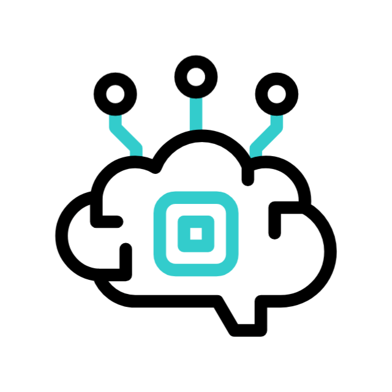

<h1 align="center">  Hi, I am a Software Engineer</h1>

#  About Me

- 🚀 I’m a Senior Full Stack Software Engineer.
- 💪 I have a rich background in web development.
- 🌱 I’m currently diving into AI & ML.
- 📢 Love to learn & share with the community.
- 💬 Ask me about anything, I'll be happy to help.
- 🤝 Love to make new connections.

### 💘 Highlights 💘

  
  

#  My Stack

<table align="center">
  <tr height="80">
    <td align="center" width="90">
      
    </td>
    <td align="center" width="90">
      
    </td>
    <td align="center" width="90">
      
    </td>
    <td align="center" width="90">
      
    </td>
    <td align="center" width="90">
      
    </td>
    <td align="center" width="90">
      
    </td>
    <td align="center" width="90">
      
    </td>
    <td align="center" width="90">
      
    </td>
    <td align="center" width="90">
      
    </td>
    <td align="center" width="90">
      
    </td>
  </tr>
  <tr height="80">
    <td align="center" width="90">
      
    </td>
    <td align="center" width="90">
      
    </td>
    <td align="center" width="90">
      
    </td>
    <td align="center" width="90">
      
    </td>
    <td align="center" width="90">
      
    </td>
    <td align="center" width="90">
      
    </td>
    <td align="center" width="90">
      
    </td>
    <td align="center" width="90">
      
    </td>
    <td align="center" width="90">
      
    </td>
    <td align="center" width="90">
      
    </td>
  </tr>
  <tr height="80">
    <td align="center" width="90">
      
    </td>
    <td align="center" width="90">
      
    </td>
    <td align="center" width="90">
      
    </td>
    <td align="center" width="90">
      
    </td>
    <td align="center" width="90">
      
    </td>
    <td align="center" width="90">
      
    </td>
    <td align="center" width="90">
      
    </td>
    <td align="center" width="90">
      
    </td>
    <td align="center" width="90">
      
    </td>
    <td align="center" width="90">
      
    </td>
  </tr>
  <tr height="80">
    <td align="center" width="90">
      
    </td>
    <td align="center" width="90">
      
    </td>
    <td align="center" width="90">
      
    </td>
    <td align="center" width="90">
      
    </td>
    <td align="center" width="90">
      
    </td>
    <td align="center" width="90">
      
    </td>
    <td align="center" width="90">
      
    </td>
    <td align="center" width="90">
      
    </td>
    <td align="center" width="90">
      
    </td>
    <td align="center" width="90">
      
    </td>
  </tr>
</table>

